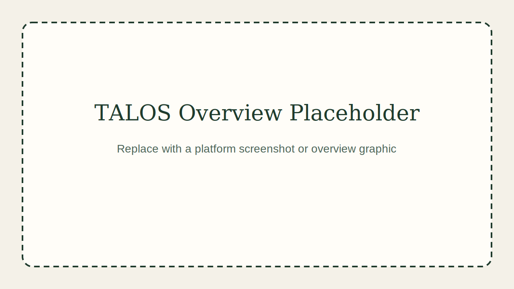

# GEOTALOS Platform

GEOTALOS is an AOI-driven geospatial AI platform for discovering imagery, running models, reviewing annotations, and automating monitoring workflows through an interactive map and visual workflow builder.

[Documentation](docs/index.md) • [Workflows](docs/workflows.md) • [Setup](docs/setup.md) • [API](docs/links/api-docs-link.md)

## Why GEOTALOS

Geospatial monitoring work is often split across multiple tools for imagery search, map viewing, model execution, annotation review, and reporting. GEOTALOS brings those steps together in one platform so teams can work from a selected area on the map instead of switching between disconnected systems.

## What You Can Do

- Search imagery and map resources for an area of interest
- Upload or register raster datasets
- Run one or more AI models on selected imagery
- Convert model outputs into map-linked geographic annotations
- Compare model outputs against each other or against ground truth
- Save AOIs, annotation sets, and workflow state for reuse
- Build and run automation pipelines for monitoring and analysis

## How It Works

1. Define an area of interest  
   Draw or load an AOI on the map to focus the workflow on a specific study area.

2. Discover relevant imagery and resources  
   Search for imagery, dataset items, and existing map resources that intersect the selected AOI.

3. Select data for analysis  
   Choose the scenes, datasets, or time-based imagery items you want to inspect or process.

4. Run one or more AI models  
   Send the selected imagery through registered models for detection, segmentation, or other spatial analysis tasks.

5. Convert outputs into map-ready annotations  
   GEOTALOS turns model outputs into geographic annotations that can be saved, compared, and visualized on the map.

6. Review and compare results  
   Inspect outputs on the map, compare multiple model runs or ground-truth annotations, and refine the results if needed.

7. Reuse the workflow  
   Save the AOI, annotation sets, and workflow setup so the same process can be repeated later or automated.

## Platform Overview



## Example Workflow


## Demo Video

Demo video coming soon.

## Documentation

More documentation is available in the project docs:

- [Overview](docs/index.md)
- [Architecture](docs/architecture.md)
- [Workflows](docs/workflows.md)
- [Setup Guide](docs/setup.md)
- [Infrastructure Notes](infra/README.md)

## Quick Start

```bash
cp .env.docker .env
docker compose up --build
```

This starts the local stack with:
- FastAPI API
- PostgreSQL + PostGIS
- pgSTAC
- TiTiler
- Redis
- MinIO
- Celery workers
- Celery Beat
- Martin vector tiles
