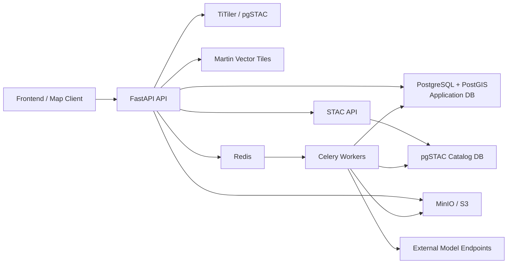

# AwakeForest Platform

AwakeForest is an AOI-first geospatial AI platform for automated landscape observation and spatial analysis. The platform supports user-provided data and heterogeneous remote-sensing models through a shared inference and annotation workflow, enabling monitoring, tracking, review, alerting, and downstream spatial analysis through an interactive map and graph-based automation system.
 in one backend system.

## Why This Platform Exists

Most geospatial AI workflows are fragmented across separate systems for:
- data discovery
- map visualization
- model execution
- annotation management
- Temporal anaylsis
- evaluation and benchmarking
- repeated operational workflows

AwakeForest brings those pieces together around a single working unit: the **Area of Interest (AOI)**. A user can select an AOI, discover imagery and resources in that area, run one or more models, evaluate the outputs, save the results as annotation layers, and automate the workflow for later reuse.

## Core Capabilities

- **AOI-first geospatial workflow** for map-driven search, preview, inference, and analysis
- **STAC and pgSTAC integration** for catalog-backed imagery discovery
- **Saved AOIs** with persisted geometry, dataset selection, rendering config, and timeline state
- **Model registry and adapter architecture** so different model request/response formats can be normalized into the same platform output
- **Annotation platform** with schemas, classes, styles, annotation sets, per-feature CRUD, collections, import, and export
- **Async inference jobs** with Celery workers, Redis, and resumable automation flows
- **Map overlay integration** so model outputs and annotations become visible layers on a map
- **Automation pipelines** for AOI discovery, model inference, evaluation, quality checks, and export
- **Model comparison workflows** for comparing multiple models on the same dataset and comparing predictions against ground truth
- **Object storage integration** with MinIO/S3 for imagery assets and downloadable exports

## What Makes AwakeForest Different

- **AOI-driven analysis**: users can upload data as files or register datasets normally, but the main workflow for discovery, inference, and analysis is centered around a selected area on the map rather than only a file or dataset ID.
- **Model outputs become usable map objects**: inference does not stop at an API response; outputs are saved as annotation sets and can be mounted on the map.
- **Model-agnostic inference**: adapters decouple the platform contract from any one model family.
- **Automation is built into the backend**: the platform supports reproducible geospatial workflows, not just CRUD endpoints.
- **Research and evaluation are part of the workflow**: multiple model runs, IoU comparison, and ground-truth validation are already part of the system.

## Architecture



### Main Infrastructure Components

- **FastAPI**: REST API, auth integration, orchestration, and tile/annotation endpoints
- **PostgreSQL + PostGIS**: application data store for maps, AOIs, annotations, jobs, and automation pipelines
- **pgSTAC**: STAC catalog database for imagery discovery and catalog-backed search
- **STAC API**: REST facade over pgSTAC for item and collection discovery
- **TiTiler**: raster previews, tilejson, mosaics, and item-level rendering
- **Martin**: vector tile serving for annotation and feature layers
- **Redis**: Celery broker/result backend and lightweight cache support
- **Celery + Celery Beat**: background execution for ingestion, inference, analysis, bulk jobs, and scheduled automation
- **MinIO / S3**: object storage for assets and downloadable exports
- **External model endpoints**: registered inference services accessed through the model registry and adapter layer

## Core Domain Model

The main backend objects are:

- **Organization**: tenant boundary for users, projects, models, and data
- **Project**: grouping of maps, datasets, and workflows
- **Map**: persisted map workspace with layers, AOIs, and mounted outputs
- **Map AOI**: saved area of interest with geometry, selected items, rendering config, and timeline state
- **Dataset**: logical collection of geospatial assets
- **Dataset Item**: imagery item or asset instance, often STAC-backed and time-stamped
- **AI Model**: registered model endpoint, auth config, request config, and adapter config
- **Annotation Schema**: ontology defining allowed geometry types and property structure
- **Annotation Class**: class labels and optional class hierarchy within a schema
- **Annotation Set**: group of annotation features, often tied to a dataset, model run, or analysis result
- **Annotation Set Collection**: group of same-schema annotation sets for future transformations and comparison workflows
- **Job**: async execution unit for inference, ingestion, and analysis
- **Automation Pipeline**: graph of nodes and edges representing a reusable workflow
- **Automation Run / Step**: execution records for pipeline runs and node-level progress

## Repository Structure

```text
app/
  api/v1/endpoints/        REST API route groups
  automation/              pipeline engine, registry, adapters, nodes
  db/                      async DB session wiring
  middleware/              auth and request middleware
  models/                  SQLAlchemy ORM models
  schemas/                 Pydantic request/response schemas
  services/                business logic and integration services
  workers/                 Celery tasks, scheduling, queue execution
alembic/                   database migrations
infra/                     deployment/infrastructure helpers
tests/                     API, workflow, and automation tests
scripts/                   helper scripts
Dockerfile                 API image build
docker-compose.yml         local multi-service stack
```

## Main User Workflows

### 1. AOI-First Discovery and Inference

1. Open a map.
2. Draw or load an AOI.
3. Search for imagery and resources intersecting that AOI.
4. Select dataset items to analyze.
5. Choose one or more models.
6. Run inference asynchronously.
7. Save outputs as annotation sets.
8. Mount outputs back onto the map.

### 2. Saved AOI Workspace

1. Save an AOI with geometry or bbox.
2. Persist dataset selection and rendering preferences.
3. Load time-ordered dataset items in that AOI.
4. Reuse the same AOI for repeated inference or automation.

### 3. Model Evaluation Workflow

1. Select a dataset or AOI item set.
2. Run multiple models on the same data.
3. Aggregate outputs from the model runs.
4. Compare model outputs pairwise by IoU.
5. Compare predictions against ground truth where available.
6. Visualize the results and disagreement areas on the map.

### 4. Automation Workflow

1. Define a pipeline graph in the automation system.
2. Select a trigger such as manual or scheduled.
3. Chain AOI selection, STAC search, inference, evaluation, and export nodes.
4. Run the pipeline manually or on a schedule.
5. Inspect run and step status through the automation endpoints.

## API Overview

The API is grouped by domain.

### Platform and Identity
- `/api/v1/health`
- `/api/v1/auth`
- `/api/v1/users`
- `/api/v1/organizations`
- `/api/v1/organization-members`
- `/api/v1/webhooks`

### Projects, Maps, and AOIs
- `/api/v1/projects`
- `/api/v1/maps`
- `/api/v1/maps/{map_id}/layers`
- `/api/v1/maps/{map_id}/aois`
- `/api/v1/maps/{map_id}/aoi/resources`
- `/api/v1/maps/{map_id}/inference`
- `/api/v1/maps/{map_id}/aois/{aoi_id}/timeline`
- `/api/v1/maps/{map_id}/aois/{aoi_id}/tilejson`
- `/api/v1/maps/{map_id}/aois/{aoi_id}/inference`

### Datasets, Catalog, and Tiles
- `/api/v1/datasets`
- `/api/v1/datasets/{dataset_id}/items`
- `/api/v1/stac`
- `/api/v1/tiles`
- `/api/v1/basemaps`
- `/api/v1/tile-sources`
- `/api/v1/feature-layers`

### Models and Jobs
- `/api/v1/models`
- `/api/v1/inference/adapters`
- `/api/v1/jobs`
- `/api/v1/jobs/inference`

### Annotations
- `/api/v1/annotation-schemas`
- `/api/v1/annotation-classes`
- `/api/v1/annotation-sets`
- `/api/v1/annotation-set-collections`
- `/api/v1/annotation-sets/{set_id}/features`
- `/api/v1/annotation-sets/{set_id}/export`
- `/api/v1/annotation-sets/{set_id}/annotations`

### Automation
- `/api/v1/automation/node-catalog`
- `/api/v1/automation/pipelines`
- `/api/v1/automation/pipelines/{pipeline_id}/run`
- `/api/v1/automation/pipelines/{pipeline_id}/duplicate`
- `/api/v1/automation/runs/{run_id}`

## Annotation System

The annotation platform currently supports:

- schema and class definition
- vector annotation CRUD
- annotation sets tied to datasets, items, jobs, or models
- style linkage for classes and layers
- import of GeoJSON into an annotation set
- export of annotation sets as downloadable GeoJSON written to MinIO/S3 with a presigned URL
- per-annotation delete for removing a faulty prediction without deleting the whole set
- project and map mounting of annotation sets
- raster-mask-oriented configuration via `raster_config`
- same-schema grouping through annotation set collections

### Current Annotation Export Flow

`POST /api/v1/annotation-sets/{set_id}/export`

Request:

```json
{
  "format": "geojson",
  "ttl_seconds": 3600
}
```

Response:

```json
{
  "annotation_set_id": "uuid",
  "format": "geojson",
  "filename": "annotation-set-<id>.geojson",
  "s3_key": "exports/annotation-sets/<id>/.../annotation-set-<id>.geojson",
  "download_url": "https://...",
  "expires_in": 3600
}
```

## Model Registry and Adapter Architecture

A registered model defines:
- endpoint URL
- auth config
- request config
- schema metadata
- adapter selection and adapter config

The adapter layer is what makes different model contracts usable by the platform.

### Current Adapter Concepts

- generic patch-based inference request body
- optional `prompt_payload` passed through unchanged from the inference request
- adapter-level mapping of prompt keys into model-specific request keys
- normalization of raw model outputs into the platform prediction structure used to create annotations

### Example Use Case

For a SAM-style model:
- the frontend sends generic `prompt_payload`
- the platform forwards it into the inference body
- the SAM adapter maps those keys into the exact SAM request shape
- the model output is then normalized into annotation features that can be persisted and mounted on the map

## Automation System

AwakeForest includes a graph-based automation engine.

### Main Components

- **AutomationPipeline**: stored pipeline graph, trigger type/config, and status
- **AutomationRun**: a single execution of a pipeline
- **AutomationRunStep**: per-node execution record including input resolution, status, outputs, and errors
- **Engine**: validates node graph structure, resolves inputs from upstream nodes, and dispatches ready steps
- **Celery workers**: execute long-running steps, especially inference and scheduled automation
- **Celery Beat**: registers and runs scheduled pipelines

### Node Categories in the Current Codebase

- **Triggers**
  - Manual Trigger
  - On Schedule
  - On Dataset Ingested
  - On Annotation Created
  - On Threshold Breach

- **Data Source**
  - Select Dataset
  - Select Dataset Items
  - Select Annotation Set
  - STAC Search
  - AOI Filter
  - Select Map Datasets
  - Search Map AOI Resources
  - Select Map Dataset Items In AOI
  - Select Saved Map AOI
  - Load Saved Map AOI Timeline

- **ML / Annotation**
  - Select Model
  - Run Inference
  - Post-Processing
  - Create Annotation Set

- **IoU / Quality**
  - Ground Truth Comparison
  - Multi-Model IoU Comparison
  - IoU Threshold Gate
  - Spatial Rule Checker
  - Duplicate Detection

- **Analysis**
  - Area Calculation
  - Timeseries Analysis
  - Aggregate Model Runs
  - Zonal Statistics
  - Anomaly Detection
  - Change Detection
  - Object State Tracking

- **Map / Overlay**
  - Overlay On Map
  - Overlay Inference Outputs
  - Overlay Dataset On Map
  - Style Assignment
  - Export Annotations
  - Export Dataset Items

- **Data Operations**
  - Filter Annotations
  - Merge Annotation Sets

- **Output**
  - Send Webhook

### Important Automation Behavior

- Nodes connect through typed handles such as `dataset_items`, `model`, `raw_predictions`, `annotation_set`, and `quality_metrics`.
- The engine now supports multi-input nodes for cases like model comparison, where one downstream node consumes multiple inference outputs.
- Long-running inference can defer execution and resume the pipeline when the async job completes.
- Pipelines can be duplicated across project, map, and AOI contexts using the pipeline duplicate endpoint.

### Example Working Pipelines

#### AOI-driven inference
`Select Saved Map AOI -> Load Saved Map AOI Timeline -> Select Model -> Run Inference -> Overlay Inference Outputs`

#### STAC-driven inference
`STAC Search -> AOI Filter -> Select Model -> Run Inference -> Overlay Inference Outputs`

#### Ground-truth evaluation
`Select Dataset Items -> Select Model -> Run Inference -> Ground Truth Comparison -> IoU Threshold Gate`

#### Multi-model comparison
`Select Dataset Items -> Select Model A -> Run Inference`
`Select Dataset Items -> Select Model B -> Run Inference`
`Select Dataset Items -> Select Model C -> Run Inference`
then:
- `Aggregate Model Runs`
- `Multi-Model IoU Comparison`

## Local Development

### Prerequisites

- Docker and Docker Compose
- Python 3.11
- Poetry

### Recommended Local Setup

1. Copy the Docker env template:

```bash
cp .env.docker .env
```

2. Review and update secrets in `.env`.

3. Start the full stack:

```bash
docker compose up --build
```

This starts:
- app-db (PostgreSQL + PostGIS)
- stac-db (pgSTAC)
- stac-api
- titiler
- redis
- minio
- api
- celery workers
- celery beat
- flower
- martin

### Running the API on the Host

If you want to run the API directly on the host while using Docker-backed infrastructure:

```bash
poetry install
poetry run uvicorn app.main:app --reload --port 2024
```

Use the host-based URLs already documented in `.env.docker` for:
- `APP_DATABASE_URL`
- `STAC_DATABASE_URL`
- `STAC_READ_URL`
- `STAC_SYNC_DATABASE_URL`
- `REDIS_URL`
- `AWS_ENDPOINT_URL`
- `PUBLIC_MINIO_URL`
- `STAC_API_URL`
- `TITILER_URL`
- `PUBLIC_API_URL`

### Running Workers on the Host

Example worker commands:

```bash
poetry run celery -A app.workers.celery_app.celery_app worker -Q inference --loglevel=INFO
poetry run celery -A app.workers.celery_app.celery_app worker -Q automation --loglevel=INFO
poetry run celery -A app.workers.celery_app.celery_app beat --loglevel=INFO
```

## Configuration

Important environment variables include:

| Variable | Purpose |
|---|---|
| `APP_DATABASE_URL` | Application Postgres/PostGIS database |
| `CELERY_DATABASE_URL` | Worker DB access path |
| `STAC_DATABASE_URL` | STAC ingest/write path |
| `STAC_READ_URL` | STAC read-only path |
| `STAC_SYNC_DATABASE_URL` | Sync STAC access for worker-side ingestion |
| `REDIS_URL` | Celery broker and result backend |
| `AWS_ENDPOINT_URL` | MinIO/S3 endpoint |
| `PUBLIC_MINIO_URL` | Browser-facing object storage URL |
| `S3_BUCKET_PREFIX` | Per-org bucket prefix |
| `STAC_API_URL` | STAC API base URL |
| `TITILER_URL` | Internal TiTiler base URL |
| `MARTIN_URL` | Internal Martin vector tile server URL |
| `PUBLIC_API_URL` | Public backend base URL for rewritten tile links |
| `CLERK_FRONTEND_API` | Clerk frontend API domain |
| `CLERK_SECRET_KEY` | Clerk server secret |
| `CLERK_WEBHOOK_SECRET` | Clerk webhook validation secret |
| `INTERNAL_API_KEY` | Internal backend/frontend relay secret |

## Testing

Install dependencies and run:

```bash
poetry install
poetry run pytest
```