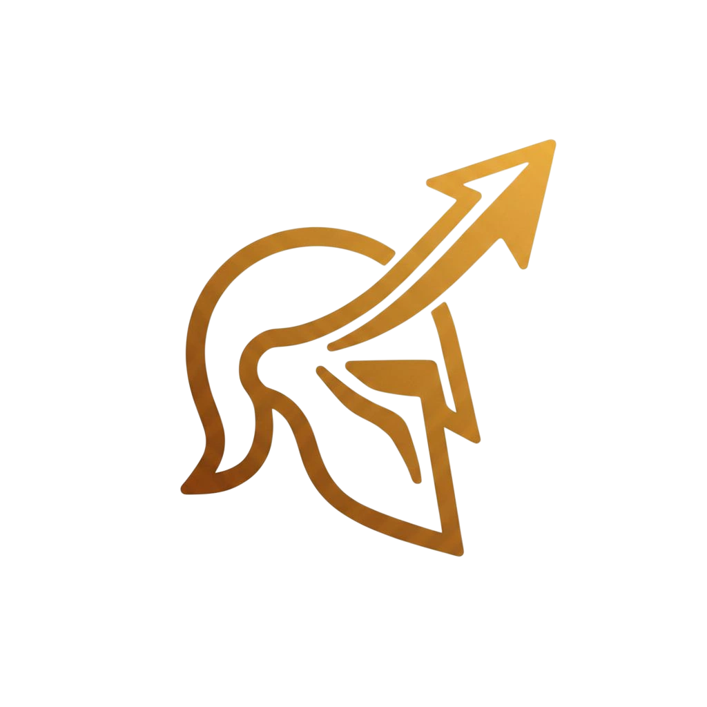
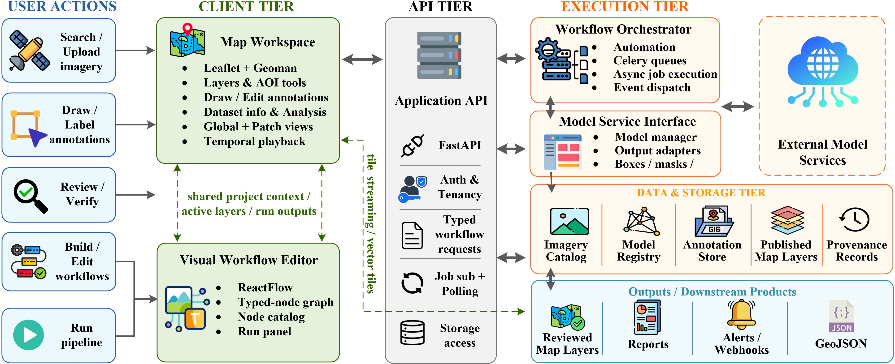
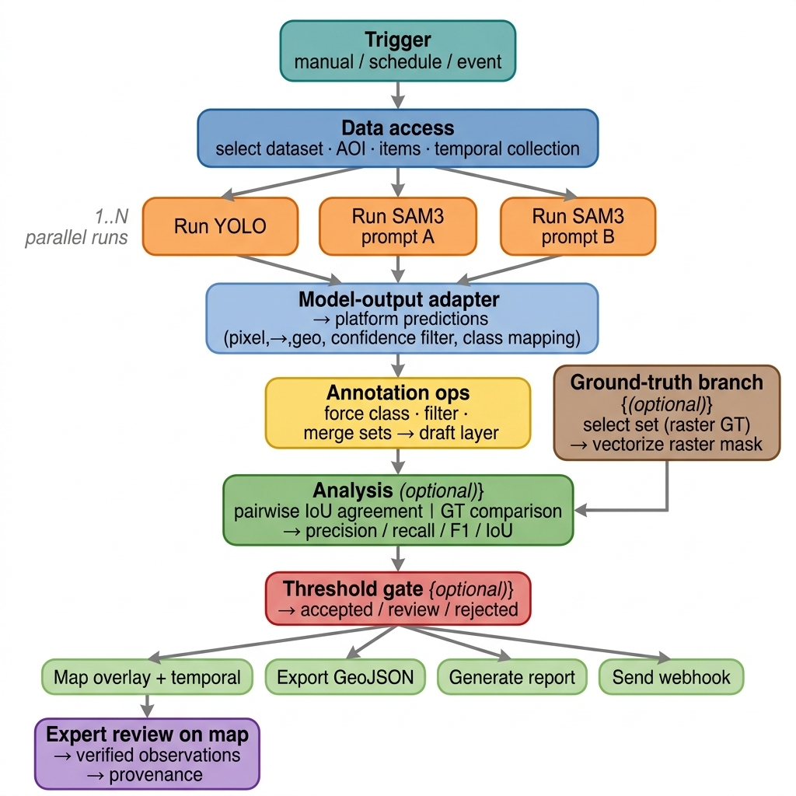

<p align="center">
  
</p>

<h1 align="center">GeoTALOS Platform</h1>

<p align="center">
  
  
  
</p>

<p align="center">
  GeoTALOS is an AOI-driven geospatial AI platform for discovering imagery, running models, reviewing annotations, and automating monitoring workflows through an interactive map and visual workflow builder.
</p>

<p align="center">
  <a href="docs/index.md">📘 Documentation</a> •
  <a href="docs/workflows.md">🧩 Workflows</a> •
  <a href="docs/architecture.md">🏗️ Architecture</a> •
  <a href="docs/setup.md">⚙️ Setup</a> •
  <a href="docs/links/api-docs-link.md">🔌 API</a> •
  <a href="https://github.com/spygaurad/GeoTalosUI">🖥️ UI Repo</a>
</p>

## Highlights

- 🗺️ **AOI-driven analysis** for map-centered discovery and monitoring
- 🤖 **Model integration** through a shared platform workflow
- 📍 **Map-linked annotations** for reviewing and reusing results
- ⚙️ **Visual workflow automation** for repeatable monitoring tasks
- 🔁 **Model comparison** against other models or ground truth

## Why GeoTALOS

> GeoTALOS brings imagery discovery, model execution, annotation review, and workflow automation into one map-centered platform so teams can work from a selected area instead of switching between disconnected tools.

## What You Can Do

### Data and Discovery

- 🛰️ Search imagery and map resources for an area of interest
- 📦 Upload or register raster datasets
- 🧭 Reuse saved AOIs and workflow state

### Model and Annotation Workflows

- 🤖 Run one or more AI models on selected imagery
- 📍 Convert model outputs into map-linked geographic annotations
- ✅ Compare model outputs against each other or against ground truth

### Automation and Reuse

- ⚙️ Build and run automation pipelines for monitoring and analysis
- ♻️ Save AOIs, annotation sets, and workflow state for reuse

## How It Works

### 1. Discover

- **📍 Define an area of interest**  
  Draw or load an AOI on the map to focus the workflow on a specific study area.
- **🛰️ Discover relevant imagery and resources**  
  Search for imagery, dataset items, and existing map resources that intersect the selected AOI.
- **📦 Select data for analysis**  
  Choose the scenes, datasets, or time-based imagery items you want to inspect or process.

### 2. Analyze

- **🤖 Run one or more AI models**  
  Send the selected imagery through registered models for detection, segmentation, or other spatial analysis tasks.
- **🗺️ Convert outputs into map-ready annotations**  
  GeoTALOS turns model outputs into geographic annotations that can be saved, compared, and visualized on the map.

### 3. Review and Reuse

- **✅ Review and compare results**  
  Inspect outputs on the map, compare multiple model runs or ground-truth annotations, and refine the results if needed.
- **♻️ Reuse the workflow**  
  Save the AOI, annotation sets, and workflow setup so the same process can be repeated later or automated.

## Platform Overview



## Example Workflow



## Demo Video

<p align="center">
  <a href="https://www.youtube.com/watch?v=KoLlAJi2LYg">
    
  </a>
</p>

<p align="center">
  <a href="https://www.youtube.com/watch?v=KoLlAJi2LYg">Watch the GeoTALOS demo video</a>
</p>

## Documentation

More documentation is available in the project docs:

- [Overview](docs/index.md)
- [Architecture](docs/architecture.md)
- [Workflows](docs/workflows.md)
- [Setup Guide](docs/setup.md)
- [Infrastructure Notes](infra/README.md)

## Related Repositories

- [GeoTALOS UI](https://github.com/spygaurad/GeoTalosUI) — frontend map workspace and visual workflow interface

## Quick Start

```bash
cp .env.docker .env
docker compose up --build
```

This starts the local stack with:
- FastAPI API
- PostgreSQL + PostGIS
- pgSTAC
- TiTiler
- Redis
- MinIO
- Celery workers
- Celery Beat
- Martin vector tiles
