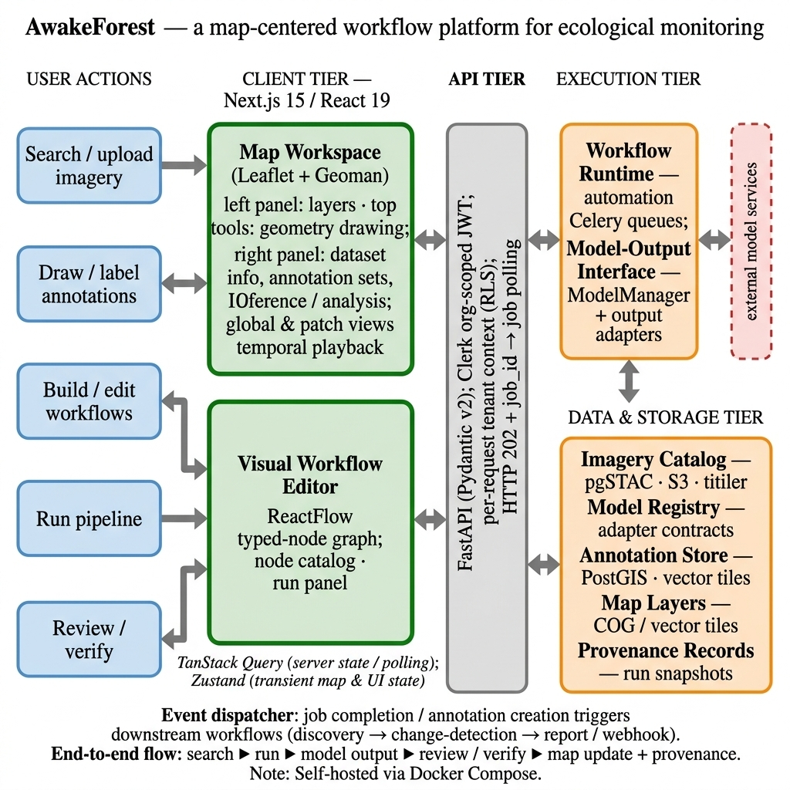

# Architecture

GEOTALOS is organized into four main tiers.

## Client

- Next.js
- React
- Leaflet with Geoman
- ReactFlow

## API

- FastAPI
- Pydantic v2
- Clerk authentication
- PostgreSQL Row-Level Security

## Execution

- Celery workers
- Redis
- Automation engine
- Celery Beat scheduling

## Data and Storage

- PostgreSQL + PostGIS
- pgSTAC
- MinIO / S3
- TiTiler
- Martin
