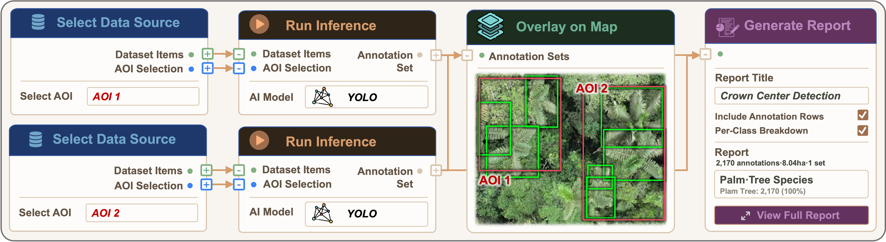

# Workflows

GEOTALOS supports map-centered workflows for geospatial monitoring and analysis.

## AOI-Driven Workflow

1. Draw an area of interest
2. Search imagery and map resources
3. Select data
4. Run one or more models
5. Review and compare outputs
6. Save results back to the map

## Automation Workflow

1. Build a typed visual workflow
2. Connect triggers, data, model, analysis, and output steps
3. Run manually or on a schedule
4. Inspect outputs on the map
